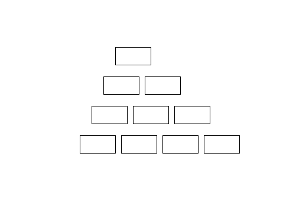

# Pattern_Printer 🐢🎨

**Draw amazing shapes with Python's turtle graphics!** ✨

This project allows you to create visually appealing patterns using the turtle graphics library in Python.  Choose from squares, rectangles, circles, and even pyramids!  It's like having your own tiny, programmable artist. 😉

---

## Features

* **Multiple Shape Options:** Generate patterns using squares, rectangles, circles, and pyramids.
* **User-Friendly Interface:**  Simple input prompts guide you through the process.
* **Customizable Rows:** Specify the number of rows in your pattern.
* **Turtle Graphics Power:**  Leverages the fun and visual capabilities of Python's `turtle` library.
* **Error Handling:** Gracefully handles invalid user input.

---

## Tech Stack

* **Python:**  The core programming language.
* **Turtle Graphics:**  The library used for drawing.

---

## Installation Steps

1. **Make sure you have Python installed.** You can download it from [python.org](https://www.python.org/).
2. **Clone the repository:**  `git clone <repository_url>` (Replace `<repository_url>` with the actual URL of your GitHub repository).
3. **Navigate to the project directory:** `cd Pattern_printer`

---

## Usage Instructions

1. **Run the script:** `python pattern_printer.py`
2. **Select a shape:** Choose from "pyramid", "square", "circle", or "rectangle".
3. **Enter the number of rows:** Specify how many rows you want in your pattern.
4. **Watch the magic unfold!**  Your pattern will be drawn on the screen.

---

## Examples

